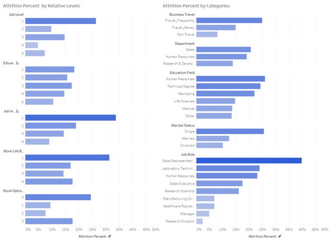
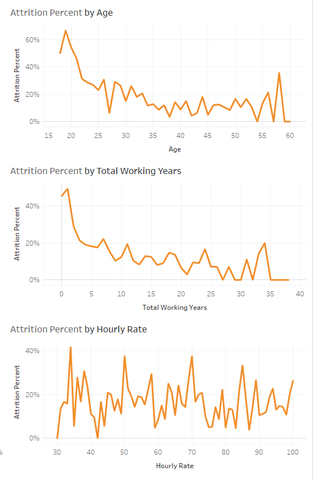
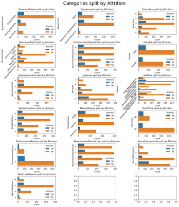

# **Question 3:** How likely are employees to attrite based on their habits, roles, or attributes?

### **Figure 3.1:** Bar Graph Visualization by Categorical Data

This is a visualization representation of attrition percentages across a variety of different categories using a bar graph. There are a multitude of different insights that can be gathered from this regarding the significance, effect, and correlation of each category to attrition. Some notable points are sales representatives have a staggering 40% attrition rate, traveling more frequently actually increases attrition, and job, education, job involvement, work-life balance, and stock option levels all generally work towards decreasing attrition.

---

### **Figure 3.2:** Line Graph Visualization by Numerical Data

This is a visualization representation of attrition percentages for different attributes using a line graph. The visualizations emphasize the relationship of the numerical values to attrition percentages which cover the numerical data thus including figure 3.1, which covers all the columns for the data set. Some notable insights we can gather from the visualizations are that generally as total working years and age increase, the attrition rate decrease which creates an inverse relationship. Lastly, contradictory to most assumptions, employee hourly rate does not seem to have a significant effect on attrition

---

### **Figure 3.3:** Bar Graph Visualization Split by Attrition

This is a visualization representation of attrition percentages for different attributes using a bar graph split by attrition responses. Similar visualizations to figure 3.1 but highlight the individual responses instead of the percentages. Similar insights from figure 3.1 can be gathered from this figure as well. Regarding unmentioned insights, it can be seen that a few sections of each category have extremely low responses which could cause high variance with the data and thus make it unreliable. An example of this would be the highest/lowest levels of numerous categories and human resources with do not exceed a few hundred responses

--- 

# **Conclusion**

This data-analysis project yielded numerous exciting results which grouped themselves around each of the research questions. To summarize the key results, the study found relationships between both numerical and categorical data and the rates of attrition among employees. Furthermore, it found an emphasis on how age correlates to different attributes that then in turn affect attrition as younger generations were typically more likely to face attrition. Lastly, evaluating the categories themselves, the study found the distribution of respondees within each category such as job involvement, work-life balance, and income.

This project taught the researchers many invaluable lessons that can be used not only in their future careers but also in their daily lives. These lessons can be derived from not only the data but also from how they progressed through the project. Data analysis techniques, as well as data visualization tools, were thoroughly explored and tested using the project. Lastly, the data itself lends a hand to how the researchers who are future employees should conduct themselves to put their careers at a statistically advantageous position regarding employee attrition.
