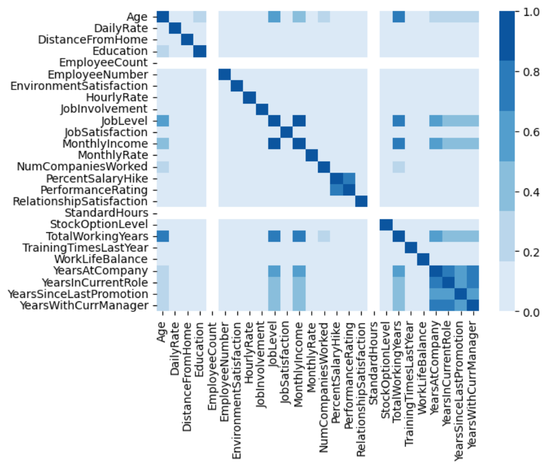
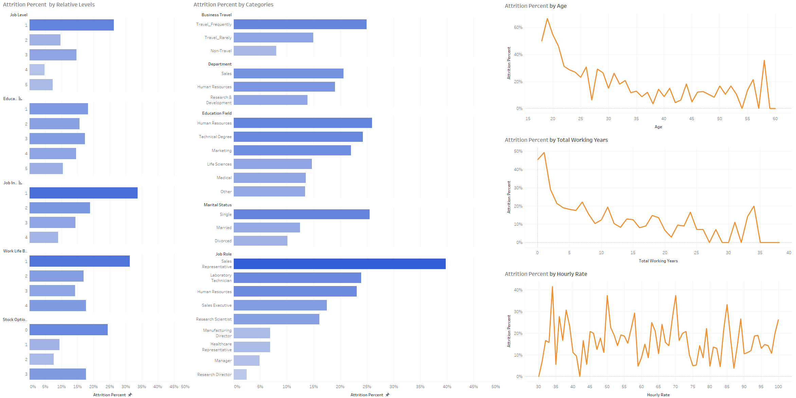
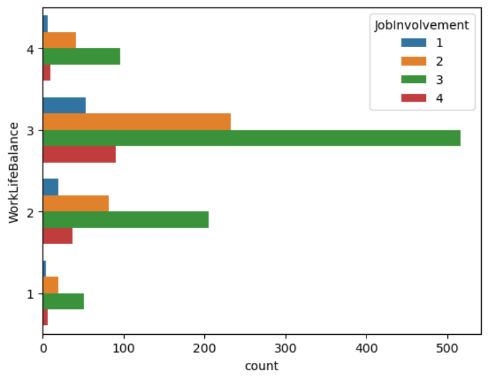
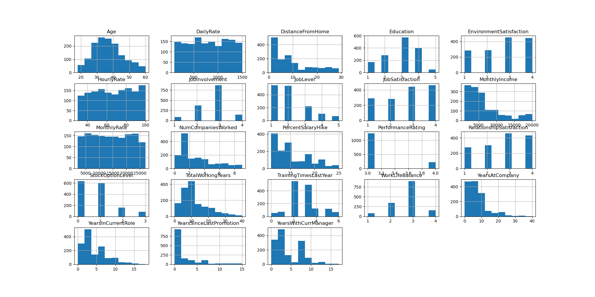
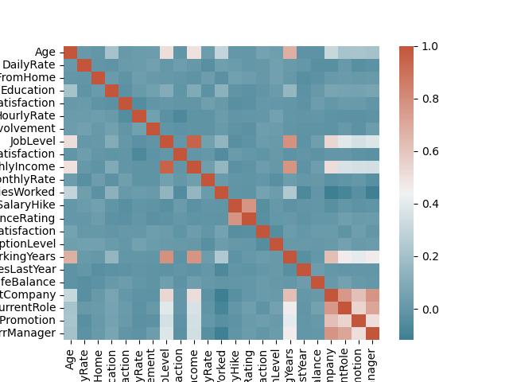
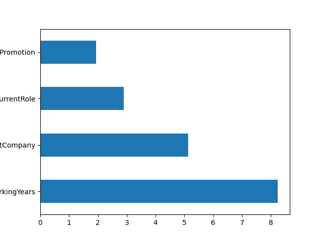
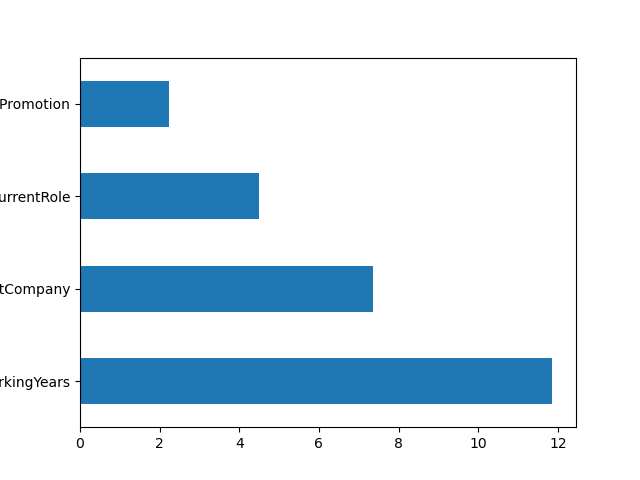
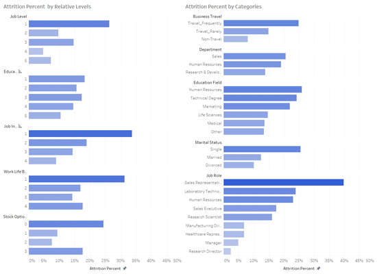
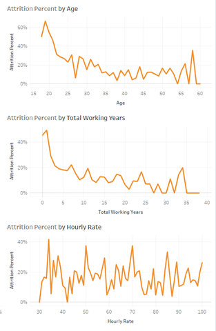
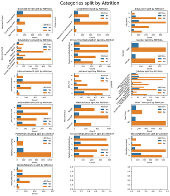

# **Introduction**
As students currently working and soon to be transitioning into full-time employment, the dataset is highly relevant to the team. Mental health in the workplace is rapidly becoming a more common topic, and knowing what factors may cause employee attrition is good for anyone to know. We are interested in this dataset because we want to understand the leading factors that lead to employee attrition and more importantly, how we could use that to our benefit. We think this dataset is also broad enough that all members of the team will have their separate unique motivations which will make the project more meaningful for everyone.

# **Exploratory Data Analysis**
The EDA extracted some general information from the dataset. Examples of this would be the shape, column names, and descriptions of both the numerical and categorical data. Furthermore, the HR employee attrition report looks at a wide variety of employees and analyzes the different potential factors that may cause employee attrition. This dataset aims to predict employee attrition by analyzing related to employee background, job conditions, and environment variables. Lastly, the researchers had a few interesting visualization for their dataset regarding the EDA.

### **Figure 1.1:** Heatmap of Dataset Columns

The figure above shows how each of the dataset variables correlates with one another other.

---

### **Figure 1.2:** Attrition Percent to Categories

The figure showcases the main point of our dataset Employee Attrition. As our dataset is called HR-Employee-Attrition it was very important to see how employee attrition % correlated to the other variables in this dataset like Job Level, Business Travel, Marital Status, etc.

---
# **Question 1:** How does job involvement impact work life balance and environmental satisfaction?

### **Figure 2.1:** Worklife Balance vs Job Involvement

From this data, we can see that the large majority of people reported a work-life balance of 3/4 and job involvement of 3/4. Something interesting to note is that as the total amount is higher, however, the proportional amount are staying relatively the same. This means that Job involvement does not seem to affect work-life balance.

---

### **Figure 2.2:** Enviromental Satisfaction vs Job Involvement

Finally, how does job involvement impact environmental satisfaction? From looking at this graph you can see that the proportional amounts of people reporting change as you increase job involvement. At a job involvement level of 3, you are more likely to have higher environmental satisfaction. When compared to a job involvement of 4 you will have lower levels of 3-4 environmental satisfaction.

# **Question 2:** How does age influence attrition? Is it because of how long they have been at a company? If they have advanced through promotions?

### **Figure 3.1:** Histogram Visualization of all Categorical Data

This is a histogram view of all of the categorical data across the attrition database. From this data, the researchers first noticed the Age plot where the number of people in the database increased with age and slowly decreased. This felt obvious at first, as it's a basic view of the literal work population, but the researchers wanted to explore this more.

### **Figure 3.2:** Heatmap of data

This is another general overview of all of the data, and what the researchers took away was that the correlations between Total Working Years and Job Level and Monthly income. the researchers wanted to learn more if younger or older people felt attrition, and what applied to that. Did younger people more attrition as they were more unsatisfied with conditions, and had a fresher perspective on the work environment? Or did older people have more attrition, as the world changed around them and they kept having to adapt?

### **Figure 3.3 and 3.4:** Bar Graph of Average Age and other Time Related Data

The way the researchers looked further into this was to divide it firmly into who felt attrition and who didn't. From each side the researchers found the average of several factors the researchers felt were influential, and saw which was more impactful on attrition. What the researchers saw was that people with attrition had worked less, both in total and at their current job. This could be seen as if they have attrition then they are more likely to have gone to another job, but they are also younger with less working years.

# **Question 3:** How likely are employees to attrite based on their habits, roles, or attributes?

### **Figure 4.1:** Bar Graph Visualization by Categorical Data

This is a visualization representation of attrition percentages across a variety of different categories using a bar graph. There are a multitude of different insights that can be gathered from this regarding the significance, effect, and correlation of each category to attrition. Some notable points are sales representatives have a staggering 40% attrition rate, traveling more frequently actually increases attrition, and job, education, job involvement, work-life balance, and stock option levels all generally work towards decreasing attrition.

---

### **Figure 4.2:** Line Graph Visualization by Numerical Data

This is a visualization representation of attrition percentages for different attributes using a line graph. The visualizations emphasize the relationship of the numerical values to attrition percentages which cover the numerical data thus including figure 3.1, which covers all the columns for the data set. Some notable insights we can gather from the visualizations are that generally as total working years and age increase, the attrition rate decrease which creates an inverse relationship. Lastly, contradictory to most assumptions, employee hourly rate does not seem to have a significant effect on attrition

---

### **Figure 4.3:** Bar Graph Visualization Split by Attrition

This is a visualization representation of attrition percentages for different attributes using a bar graph split by attrition responses. Similar visualizations to figure 3.1 but highlight the individual responses instead of the percentages. Similar insights from figure 3.1 can be gathered from this figure as well. Regarding unmentioned insights, it can be seen that a few sections of each category have extremely low responses which could cause high variance with the data and thus make it unreliable. An example of this would be the highest/lowest levels of numerous categories and human resources with do not exceed a few hundred responses

# **Conclusion**

This data-analysis project yielded numerous exciting results which grouped themselves around each of the research questions. To summarize the key results, the study found relationships between both numerical and categorical data and the rates of attrition among employees. Furthermore, it found an emphasis on how age correlates to different attributes that then in turn affect attrition as younger generations were typically more likely to face attrition. Lastly, evaluating the categories themselves, the study found the distribution of respondees within each category such as job involvement, work-life balance, and income.

This project taught the researchers many invaluable lessons that can be used not only in their future careers but also in their daily lives. These lessons can be derived from not only the data but also from how they progressed through the project. Data analysis techniques, as well as data visualization tools, were thoroughly explored and tested using the project. Lastly, the data itself lends a hand to how the researchers who are future employees should conduct themselves to put their careers at a statistically advantageous position regarding employee attrition.
