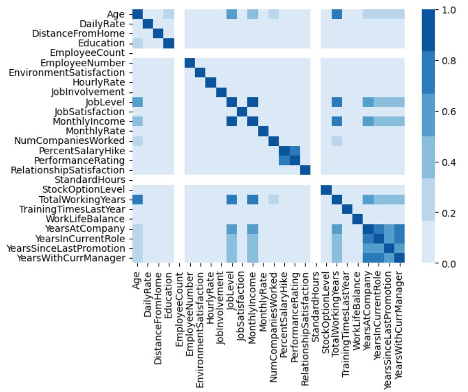
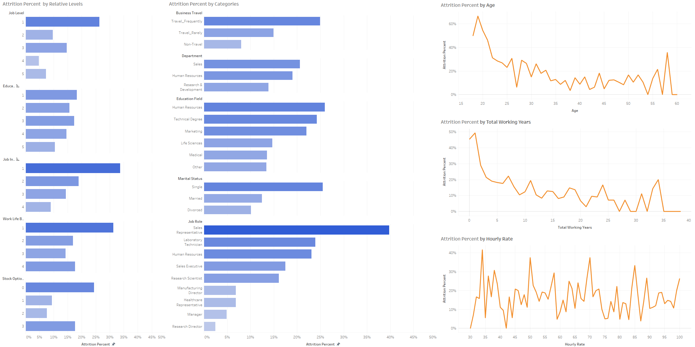
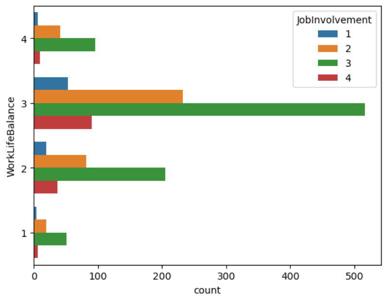
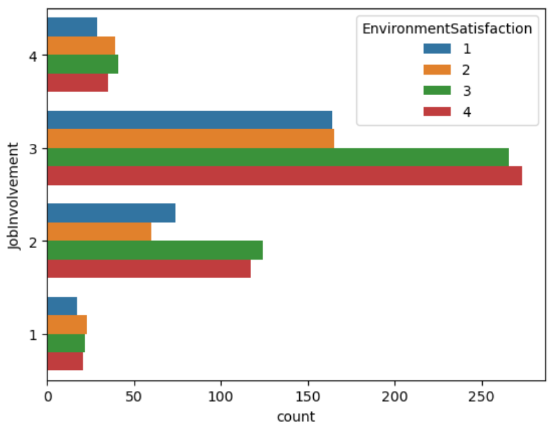

# Exploratory Data Analysis
 Our group had a few intereresting visualization for our dataset.
</img>

### **Figure 1.1:** Heatmap of dataset columns
This shows how each of our datasets variables correlate with each other.
---
</img>

### **Figure 1.2:** Attrition % to other variables

This images showcases the main point of our dataset Employee Attrition. As our dataset is call HR-Employee-Attrition it was very important to see how employee attrition % correlated to the other variables in this dataset like Job Level, Business Travel, Marital Status, etc.

---
# **Question 1:** How does job involvement impact work life balance and environmental satisfaction?

</img>

### **Figure 1.3:** Worklife Balance vs Job Involvement

From this data, we can see that the large majority of people reported a work-life balance of 3/4 and job involvement of 3/4. Something interesting to note is that as the total amount is higher, however, the proportional amount are staying relatively the same. This means that Job involvement does not seem to affect work-life balance.

---
</img>

### **Figure 1.3:** Enviromental Satisfaction vs Job Involvement

Finally, how does job involvement impact environmental satisfaction? From looking at this graph you can see that the proportional amounts of people reporting change as you increase job involvement. At a job involvement level of 3, you are more likely to have higher environmental satisfaction. When compared to a job involvement of 4 you will have lower levels of 3-4 environmental satisfaction.